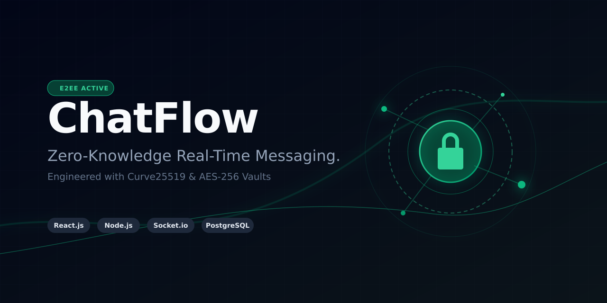

<h1 align="center">
  <br>
  🌊 ChatFlow
  <br>
</h1>

<h4 align="center">A high-performance, real-time messaging platform engineered with zero-knowledge End-to-End Encryption (E2EE) and cross-device synchronization.</h4>

<p align="center">
  <a href="#-overview">Overview</a> •
  <a href="#-system-architecture">Architecture</a> •
  <a href="#-cryptography--security">Cryptography</a> •
  <a href="#-tech-stack">Tech Stack</a> •
  <a href="#-features--roadmap">Roadmap</a> •
  <a href="#-getting-started">Getting Started</a>
</p>

<p align="center">
  
  
  
  
  
</p>

<p align="center">
  <a href="https://chat-flow-ugn4.vercel.app/">
    
  </a>
</p>

---



## 🚀 Overview

**ChatFlow** is a modern, zero-knowledge web application designed to demonstrate robust real-time bidirectional communication and military-grade data security. Moving beyond traditional HTTP polling, this application leverages persistent WebSocket connections to deliver instant messaging with zero perceivable delay. 

Built with an uncompromising focus on privacy, ChatFlow features a custom **End-to-End Encryption (E2EE)** engine. The backend acts strictly as a blind relay—it only stores scrambled Base64 ciphertexts and AES-locked keystores. The server never has access to plaintext messages or the private keys required to read them.

---

## 📸 Interface Gallery

<details>
  <summary><b>View Application Screenshots</b> (Click to expand)</summary>
  <br>
  
  <p align="center">
    
    &nbsp; &nbsp;
    
  </p>
  <p align="center">
    
  </p>
</details>

---

## 🔒 Cryptography & Security

Solving the notorious "Cross-Device Paradox" of End-to-End Encryption requires advanced architectural patterns. ChatFlow achieves seamless cross-device synchronization without compromising zero-knowledge principles via a dual-layer cryptographic engine:

* **Asymmetric Message Encryption (`tweetnacl`):** Every device generates a unique Curve25519 Public/Private key pair in local memory. Outgoing messages are encrypted via `nacl.box` using the recipient's public key, ensuring only the recipient's device can unlock the payload.
* **Symmetric Password Vaults (`crypto-js`):** To allow users to log in from new devices without losing their chat history, the application wraps the user's local Private Key inside an **AES-256 Vault**, locked by their plaintext password. This vault is safely stored in the cloud. Upon login, the browser receives the vault and uses the entered password to instantly decrypt the private key back into local memory.

---

## 🏗 System Architecture

The application separates concerns into four distinct layers to ensure absolute security and efficient data flow:

1. **The Client Layer (React/Vercel):** Manages local UI state, securely stores authentication tokens, and acts as the execution environment for the cryptographic engine.
2. **The Cryptographic Layer (Web Crypto):** Intercepts all outgoing text to lock payloads into ciphertexts *before* network transmission, and unlocks incoming WebSockets *after* they hit the browser.
3. **The Transport Layer (Node/Render/Socket.IO):** The central nervous system. It validates JWTs for HTTP requests and routes secure WebSocket payloads without ever reading their contents.
4. **The Zero-Knowledge Data Layer (Prisma/Neon DB):** Intercepts incoming payloads, validates relational constraints, and commits data to serverless PostgreSQL. It holds only encrypted vaults and ciphertexts.

---

## 💻 Tech Stack

### Frontend & Cryptography
* **React.js** - UI component architecture and state management.
* **TweetNaCl.js** - High-speed asymmetric cryptography (Curve25519, XSalsa20-Poly1305).
* **CryptoJS** - Advanced Encryption Standard (AES) for symmetric password vaults.
* **Tailwind CSS** - Utility-first styling for a highly responsive interface.
* **Deployed on:** Vercel (Edge Network)

### Backend & Database
* **Node.js & Express.js** - REST API routing and middleware management.
* **Socket.IO** - Event-driven, low-latency real-time server.
* **JSON Web Tokens (JWT)** - Stateless user authentication.
* **PostgreSQL (Neon)** - Serverless relational database for persistent data storage.
* **Prisma ORM** - Type-safe database client and schema modeling.
* **Deployed on:** Render (Web Service)

---

## ✨ Features & Roadmap

### Phase 1: Core Foundation & Cryptography (Completed)
- ✅ **Military-Grade E2EE:** Absolute message privacy via local Curve25519 asymmetric encryption.
- ✅ **The Password Vault:** AES-encrypted keystores allowing seamless, secure cross-device synchronization.
- ✅ **Zero-Knowledge Backend:** The database only stores unreadable ciphertexts and locked vaults.
- ✅ **Real-Time Engine:** Instant bidirectional message delivery via WebSockets.
- ✅ **Stateless Authentication:** Secure registration and login via JWT and bcrypt.
- ✅ **Live Presence System:** Dynamic Online/Offline status tracking across the network.
- ✅ **Live Typing Indicators:** Real-time UI updates broadcasting "typing..." status via WebSockets.
- ✅ **Group Chat Engine:** Multi-user rooms with dynamic participant management.

### Phase 2: Enhanced User Experience (Planned)
- ⏳ **Read Receipts & Last Seen:** Tracking message consumption and user activity state.
- ⏳ **Message Search:** Indexed database querying for historical message retrieval.
- ⏳ **Dark Mode Toggle:** Context-aware theming and optimized layouts.

### Phase 3: Advanced Capabilities (Planned)
- ⏳ **Media Transport:** Secure, encrypted file and image sharing via AWS S3.
- ⏳ **Push Notifications:** Service worker integration for offline alerts.

---

## ⚙️ Getting Started (Local Development)

### Prerequisites
* Node.js (v18.x or higher)
* A PostgreSQL database instance (Local or Cloud like [Neon.tech](https://neon.tech/))

### 1. Clone the Repository
```bash
git clone [https://github.com/Vishwa7399/ChatFlow.git](https://github.com/Vishwa7399/ChatFlow.git)
cd ChatFlow