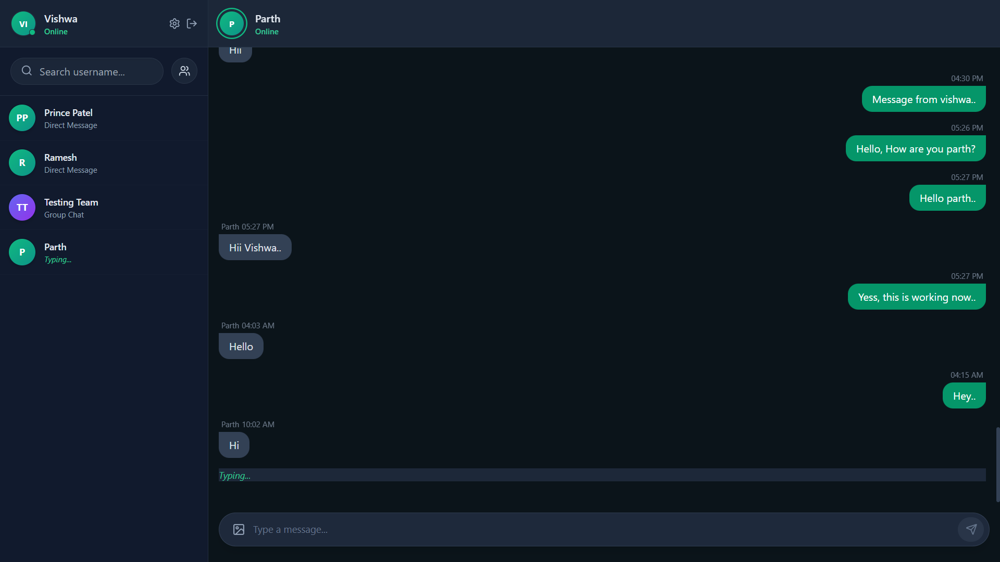
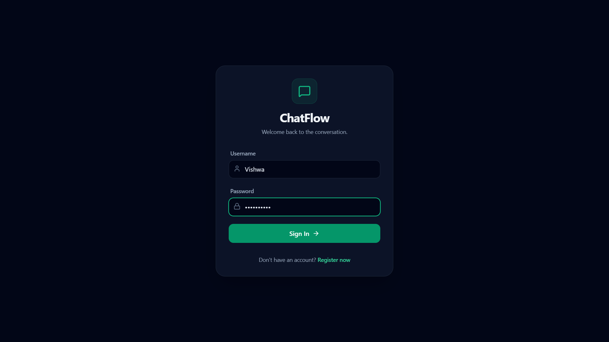
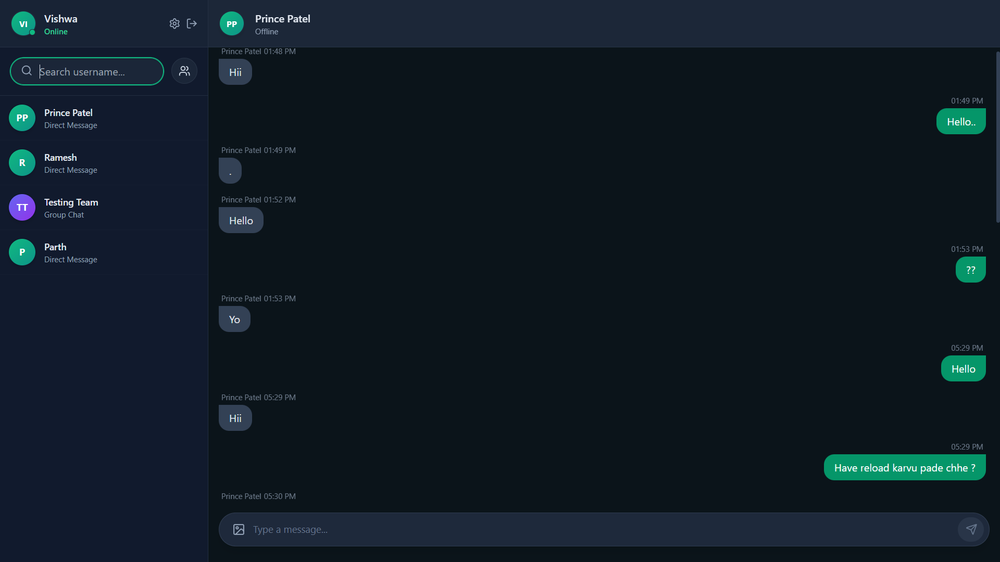
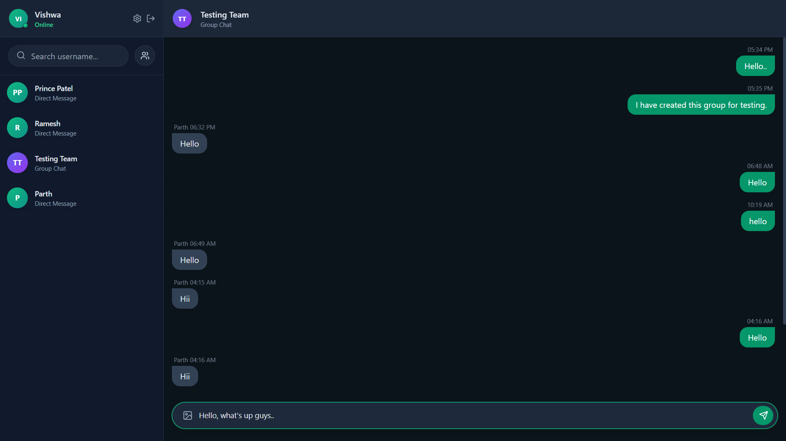

<h1 align="center">
  <br>
  🌊 ChatFlow
  <br>
</h1>

<h4 align="center">A high-performance, real-time full-stack messaging platform engineered for zero-latency communication.</h4>

<p align="center">
  <a href="#-overview">Overview</a> •
  <a href="#-system-architecture">Architecture</a> •
  <a href="#-tech-stack">Tech Stack</a> •
  <a href="#-features--roadmap">Roadmap</a> •
  <a href="#-getting-started">Getting Started</a>
</p>

<p align="center">
  
  
  
  
  
</p>

<p align="center">
  <a href="https://chat-flow-geq5.vercel.app">
    
  </a>
</p>

---



## 🚀 Overview

**ChatFlow** is a modern web application designed to demonstrate robust real-time bidirectional communication and relational data persistence. Moving beyond traditional HTTP polling, this application leverages persistent WebSocket connections to deliver instant messaging with zero perceivable delay. 

Built with a focus on scalability and security, ChatFlow utilizes a custom JWT-based authentication middleware that guards both REST API endpoints and Socket.IO connection handshakes, ensuring strict cross-chat data isolation.

---

## 📸 Interface Gallery

<details>
  <summary><b>View Application Screenshots</b> (Click to expand)</summary>
  <br>
  
  <p align="center">
    
    &nbsp; &nbsp;
    
  </p>
  <p align="center">
    
  </p>
</details>

---

## 🏗 System Architecture

The application separates concerns into three distinct layers to ensure maintainability and efficient data flow:

1. **The Client Layer (React/Vercel):** Manages local UI state, securely stores authentication tokens, and utilizes a dynamic data adapter to instantly format incoming UTC timestamps to the user's local timezone.
2. **The Transport & API Layer (Node/Render):** Acts as the central nervous system. It validates JWTs for standard HTTP requests and strictly manages Socket.IO payloads, securely injecting and verifying `conversationId` parameters to prevent cross-chat data bleeding.
3. **The Data Layer (Prisma/Neon DB):** Intercepts incoming message payloads, validates relational constraints (verifying group membership and user existence), and commits data to serverless PostgreSQL before authorizing the WebSocket broadcast.

---

## 💻 Tech Stack

### Frontend
* **React.js** - UI component architecture and state management.
* **Tailwind CSS** - Utility-first styling for a highly responsive interface.
* **Socket.IO-Client** - Managing the WebSocket connection lifecycle.
* **Deployed on:** Vercel (Edge Network)

### Backend
* **Node.js & Express.js** - REST API routing and middleware management.
* **Socket.IO** - Event-driven, low-latency real-time server.
* **Bcrypt & JSON Web Tokens (JWT)** - Cryptographic hashing and stateless user authentication.
* **Deployed on:** Render (Web Service)

### Database
* **PostgreSQL (Neon)** - Serverless relational database for persistent data storage.
* **Prisma ORM** - Type-safe database client and schema modeling.

---

## ✨ Features & Roadmap

### Phase 1: Core Foundation (Completed)
✅ **Stateless Authentication:** Secure registration and login via JWT and bcrypt.
✅ **Real-Time Engine:** Instant bidirectional message delivery via WebSockets.
✅ **Strict Payload Routing:** Eliminates cross-chat bleeding via strict ID matching.
✅ **Live Presence System:** Dynamic Online/Offline status tracking across the network.
✅ **Group Chat Functionality:** Multi-user rooms with dynamic participant management.
✅ **Live Typing Indicators:** Real-time UI updates broadcasting "typing..." status.
✅ **Relational Persistence:** Permanent, structured chat history saved to PostgreSQL.
✅ **Timezone Sync:** Automatic conversion from UTC database stamps to local browser time.

### Phase 2: Enhanced User Experience (Planned)
⏳ **Read Receipts & Last Seen:** Tracking message consumption and user activity state.
⏳ **Message Search:** Indexed database querying for historical message retrieval.
⏳ **Message Reactions:** Real-time emoji interactions mapped to specific message IDs.
⏳ **Dark Mode Toggle:** Context-aware theming and optimized layouts.

### Phase 3: Advanced Capabilities (Planned)
⏳ **End-to-End Encryption:** Client-side key generation for absolute privacy.
⏳ **Media Transport:** Secure file and image sharing via AWS S3 / Cloudinary.
⏳ **Push Notifications:** Service worker integration for offline alerts.

---

## ⚙️ Getting Started (Local Development)

### Prerequisites
* Node.js (v18.x or higher)
* A PostgreSQL database instance (Local or Cloud like [Neon.tech](https://neon.tech/))

### 1. Clone the Repository
```bash
git clone [https://github.com/Vishwa7399/ChatFlow.git](https://github.com/Vishwa7399/ChatFlow.git)
cd ChatFlow